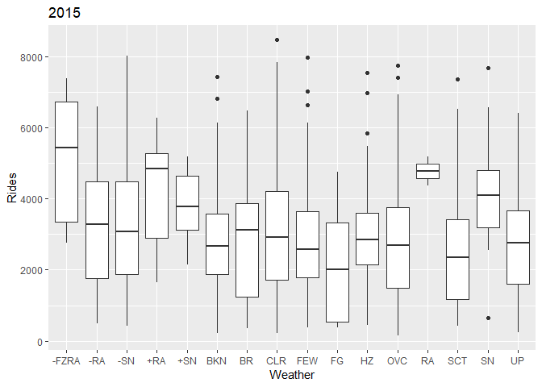
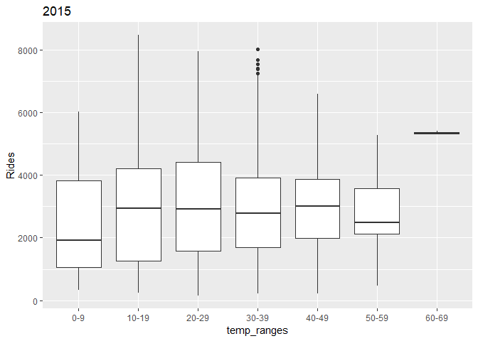

Final Report
================
Jorge Londono

Introduction
------------

The Metropolitan Transportation Authority (MTA) is New York City's public transportation system. This service allows the residents of New York City, those who live in the city's vicinity, and other visitors to have a viable means of transportation that is inexpensive and convenient. While many use it it as their main means of transportation, there are other private services such as taxis and ride share companies that have created additional options to New York City's commuters.

But why is there a such a growing market for these types of private transportation services? Ideally, a city's own transit should be able to be meet the needs of its citizens.

By looking at Uber ridership data, we can learn about what may cause the people of New York City to select more expensive private transportation services rather than the more affordable public transportation service the city provides. Using the results of this project, we can create a model that can be used to explain what factors are important and significant to the increase or decrease of Uber ridership. Additionally, this model can be used to predict the ridership for a given time and date by plugging in certain variables. This can be useful as a way for public transportation administrators to understand where and when they need to improve or expand service . Also, the results of this project can help private transportation services prepare for times when they are going to see a surge of ridership and how they can use this in order to better monetize their business.

Data Used
---------

The final data set used in this project will be a combination of 3 different data sets. The first and major one, provided by Five Thirty Eight, is Uber ridersehip data set in two different time spans from April 1st – September 30th 2014 and January 1st – March 31st 2015, containing thousands of observations . In this data set we can find the specific time and date there was a pickup by Uber.

    ##          Date.Time     Lat      Lon   Base
    ## 1 4/1/2014 0:11:00 40.7690 -73.9549 B02512
    ## 2 4/1/2014 0:17:00 40.7267 -74.0345 B02512
    ## 3 4/1/2014 0:21:00 40.7316 -73.9873 B02512
    ## 4 4/1/2014 0:28:00 40.7588 -73.9776 B02512
    ## 5 4/1/2014 0:33:00 40.7594 -73.9722 B02512
    ## 6 4/1/2014 0:33:00 40.7383 -74.0403 B02512

The next data set, contains the hourly temperature and weather conditions of a specific date This will be used to identify what the climate and the weater was for every observation in the data set.

    ##       Date Hour Temperature Weather Precip
    ## 1 1/1/2004    0          41     CLR      0
    ## 2 1/1/2004    1          41     CLR      0
    ## 3 1/1/2004    2          41     CLR      0
    ## 4 1/1/2004    3          41     CLR      0
    ## 5 1/1/2004    4          42     CLR      0
    ## 6 1/1/2004    5          41     CLR      0

Lastly, we will use a data set that has a list of holidays and its correspoding dates from 2010-2020. This will be used to see how holidays impact Uber ridership.

    ##    DAY_DATE           HOLIDAY_NAME
    ## 1  1/1/2010         New Year's Day
    ## 2 1/18/2010 Martin Luther King Day
    ## 3 2/15/2010        Presidents' Day
    ## 4  4/2/2010            Good Friday
    ## 5 5/31/2010           Memorial Day
    ## 6  7/4/2010       Independence Day

Limitations of Data
-------------------

While we can obtain many insights from this data set, there are certain questions that cannot be answered by using it. For instance, while the results of this project can help us understand what factors can be attributed to an increase in private transportation usage, it cannot identify how how much of this traffic is being diverted from public transportation. This actual piece of insight is impossible to obtain with the data used in this project because there is no information about any type of public transportation ridership. Therefore, we cannot compare and make inferences on what portion of the private transportation ridership is being used as a direct substitute for public transportation.

Something that our data set does not take into account is any other type of special event happening in NYC that is not a holiday. Could there have been a special concert many New Yorkers attended? A special fair or parade that caused many New Yorkers to leave theor homes.

Additionally, since our data set will contain no information on public transportation services, there is no way to measure if cloures, delays, and other mishaps from the MTA are affecting Uber ridership.

Data Wrangling
--------------

In order to get this data from the source to how it will finally look in the data set there are many different steps required in order fully clean and wrangle it. As stated earlier, the final data set is a compilation of 3 data sets: Uber’s ridership data, the climate and weather for the observation, and the holiday data. All of these data sets need to be combined together but before we do this, the most important value that must be correctly formatted is the date and time. Once this has been completed, we compile these data sets together and we have our final data set by which we can see all of the observations and its corresponding variables. In order to take an even closer analysis of the data, more columns were created for specific variables such as: does the observation land on a weekend (yes or no), the name of the day the observation takes place, and monthly ridership average.

Additionally, the “Weather” variable, which describes the weather condition for the observation, sometimes had multiple descriptors. For example, there were observations that were both rainy and foggy. In order to make it so that every multiple condition observation was sorted to its most similar singular condition, I took the mean ridership of both of the values(e.g. the mean ridership during foggy weather, and the mean ridership of rainy water) and then I changed the condition to whichever the mean ridership was closest between the two.

Final Data Set
--------------

The data set used for this project contains different variables that we can use to understand how Uber ridership changes based on its relationship with them. The dependent variable of the data set is “Rides” which is the total amount of rides per hour of a given date. The independent variables in this data set include time (Date and hour of the day), climate (hourly temperature), weather (condition and amount of precipitation), and holidays (federal).

    ## Joining, by = c("Date", "Hour")

    ## `stat_bin()` using `bins = 30`. Pick better value with `binwidth`.


    ## # A tibble: 6 x 16
    ## # Groups:   year, month [1]
    ##   Date       Hour  Rides Temperature Weather Precipitation Holiday_Name
    ##   <date>     <chr> <int>       <dbl> <chr>           <dbl> <fct>       
    ## 1 2014-04-01 00      138          41 CLR                 0 <NA>        
    ## 2 2014-04-01 01       66          41 CLR                 0 <NA>        
    ## 3 2014-04-01 02       53          41 CLR                 0 <NA>        
    ## 4 2014-04-01 03       93          40 CLR                 0 <NA>        
    ## 5 2014-04-01 04      166          40 CLR                 0 <NA>        
    ## 6 2014-04-01 05      333          39 CLR                 0 <NA>        
    ## # ... with 9 more variables: Holiday <chr>, Weekend <lgl>, weekday <fct>,
    ## #   year <chr>, month <fct>, week <dbl>, monthly_average <dbl>,
    ## #   temp_ranges <fct>, logvalues <dbl>

For the data visualizations, I found it necessary to make different plots for 2014 and 2015. There seemed to be a very significant increase in ridership as time went on. If I had all of my data visualizations and statistical analysis performed with 1 data set, then it would distort my results as clearly the 2015 months had around 2-3 more times the amount of rides as 2014. Therefore a 'year' column was created so that I could have 2 distinct groups of graphs.Additionally, there is a column for the amount of rides in a given observation but transformed with log10 in order to normalize the data.

``` r
ggplot(uber_weather, aes(Rides))+
  geom_histogram()
```

    ## `stat_bin()` using `bins = 30`. Pick better value with `binwidth`.


``` r
ggplot(uber_weather, aes(logvalues))+
  geom_histogram()
```

    ## `stat_bin()` using `bins = 30`. Pick better value with `binwidth`.


Data Relationships
------------------

Based on statistical analyses and data visualizations created in this project, I was able to see relationships between the dependent variable (number of rides) and different independent variables. Holidays had a dramatic effect on ridership. For example, the average daily rides for the month of April in 2014 was 784, while the daily total for Good Friday in 2014 was 18,074.

    ## # A tibble: 6 x 3
    ## # Groups:   Holiday_Name [5]
    ##   Holiday_Name           year  `sum(Rides)`
    ##   <fct>                  <chr>        <int>
    ## 1 Good Friday            2014         18074
    ## 2 Good Friday            2015         75983
    ## 3 Independence Day       2014         14148
    ## 4 Labor Day              2014         19961
    ## 5 Martin Luther King Day 2015         47025
    ## 6 Memorial Day           2014         10202

By looking at the heat map below, it is also clearly apparent that the most popular days for Uber rides were on Thursdays – Saturdays.

    ## Warning in grid.Call(C_textBounds, as.graphicsAnnot(x$label), x$x, x$y, :
    ## font family not found in Windows font database

    ## Warning in grid.Call(C_textBounds, as.graphicsAnnot(x$label), x$x, x$y, :
    ## font family not found in Windows font database

    ## Warning in grid.Call(C_textBounds, as.graphicsAnnot(x$label), x$x, x$y, :
    ## font family not found in Windows font database

    ## Warning in grid.Call(C_textBounds, as.graphicsAnnot(x$label), x$x, x$y, :
    ## font family not found in Windows font database

    ## Warning in grid.Call(C_textBounds, as.graphicsAnnot(x$label), x$x, x$y, :
    ## font family not found in Windows font database

    ## Warning in grid.Call(C_textBounds, as.graphicsAnnot(x$label), x$x, x$y, :
    ## font family not found in Windows font database

    ## Warning in grid.Call.graphics(C_text, as.graphicsAnnot(x$label), x$x,
    ## x$y, : font family not found in Windows font database

    ## Warning in grid.Call(C_textBounds, as.graphicsAnnot(x$label), x$x, x$y, :
    ## font family not found in Windows font database

    ## Warning in grid.Call(C_textBounds, as.graphicsAnnot(x$label), x$x, x$y, :
    ## font family not found in Windows font database

    ## Warning in grid.Call.graphics(C_text, as.graphicsAnnot(x$label), x$x,
    ## x$y, : font family not found in Windows font database

    ## Warning in grid.Call(C_textBounds, as.graphicsAnnot(x$label), x$x, x$y, :
    ## font family not found in Windows font database

    ## Warning in grid.Call(C_textBounds, as.graphicsAnnot(x$label), x$x, x$y, :
    ## font family not found in Windows font database


    ## Warning in grid.Call(C_textBounds, as.graphicsAnnot(x$label), x$x, x$y, :
    ## font family not found in Windows font database

    ## Warning in grid.Call(C_textBounds, as.graphicsAnnot(x$label), x$x, x$y, :
    ## font family not found in Windows font database

    ## Warning in grid.Call(C_textBounds, as.graphicsAnnot(x$label), x$x, x$y, :
    ## font family not found in Windows font database

    ## Warning in grid.Call(C_textBounds, as.graphicsAnnot(x$label), x$x, x$y, :
    ## font family not found in Windows font database

    ## Warning in grid.Call(C_textBounds, as.graphicsAnnot(x$label), x$x, x$y, :
    ## font family not found in Windows font database

    ## Warning in grid.Call(C_textBounds, as.graphicsAnnot(x$label), x$x, x$y, :
    ## font family not found in Windows font database

    ## Warning in grid.Call.graphics(C_text, as.graphicsAnnot(x$label), x$x,
    ## x$y, : font family not found in Windows font database

    ## Warning in grid.Call(C_textBounds, as.graphicsAnnot(x$label), x$x, x$y, :
    ## font family not found in Windows font database

    ## Warning in grid.Call(C_textBounds, as.graphicsAnnot(x$label), x$x, x$y, :
    ## font family not found in Windows font database

    ## Warning in grid.Call.graphics(C_text, as.graphicsAnnot(x$label), x$x,
    ## x$y, : font family not found in Windows font database

    ## Warning in grid.Call(C_textBounds, as.graphicsAnnot(x$label), x$x, x$y, :
    ## font family not found in Windows font database

    ## Warning in grid.Call(C_textBounds, as.graphicsAnnot(x$label), x$x, x$y, :
    ## font family not found in Windows font database


Additionally, when the weather conditions were better, in other words when sky was clear or when there were few clouds in the sky, ridership was lower. And when conditions were harsher, there was an increase in ridership.



The temperature also behaved similarly, but in the opposite way. When it was colder out, ridership was low, and as temperatures rose, so did the ridership.



And finally, as previously stated, there was an increase in ridership as time went on, which shows growth of Uber's services and business over time.

    ## `geom_smooth()` using method = 'gam' and formula 'y ~ s(x, bs = "cs")'


Linear Regression Model
-----------------------

Since the purpose of this project is to find out how all of the variables in the data set, such as climate and weather, date and time, and holidays affect the ridership of Uber, I will be using a linear regression model to show the relationship of the variables. To be more precise, the dependent variable (amount of rides) is a continuous variable, therefore the most apt model would be a linear regression which would be supervised since the variables to be tested will be specifically selected from the data set.

The main features of the model as mentioned earlier are: the weather conditions (e.g. is it clear, is it overcast, is it snowing, is it raining, etc.), the amount of precipitation (if any), the climate (a measurement of the temperature), the date and the hour of the day the observation took place, whether the observation takes place on a weekend, and whether the observation takes place on a Holiday.

The linear regression model that I will be training will be selected based on the highest adjusted R-square value. When I am looking at which features will be ultimately be selected, the corresponding coefficients for the model will all have to be significant.

Evaluation of Success
---------------------

Once the model has been created with my training set, I will test it out using the “predict” function in R on the testing set. The testing set is Uber Ridership data from the months of April through July in 2015. Once my model has been used on the testing set, I will use the R-squared function to find out the value of how my linear regression model preformed. I will find the Root Mean Square Error value with the testing set.

Results
-------

With the training set, my linear regression model had an adjusted R-squared value of 0.7874. The coefficient with the largest absolute t - value is the Date (65.406) which explains how Uber as a service has grown throughout in these time spans. The hour with the largest absolute t value is 18:00 or 6PM (30.864). And the weather condition with the highest t value is clear weather (3.503)

With the testing set, my linear regression model had an R - Squared value of 0.8756. This is value shows a fairly strong relationship between the features of my model and Uber Ridership.

The Root Mean Square Error value while using the testing set is 0.1785

Further Study
-------------

Areas and topics that can be further studied with these results and data can include:

-   How do the features in the linear regression model relate to public transportation usage?
-   What areas of New York City experience more Uber pickups?
-   How do MTA delays and service changes affect Uber ridership?

Recommendations
---------------

Based on the results of this project I would recommend to Uber to further increase the availability of their services during holidays since the ridership in these days is dramatically higher than other days.

Addtionally, Uber should in general be increasing the amount of service they provide as we can see that their popularity as a means of transportation is increasing as time goes on in NYC.

Finally, using the linear regression model, we can conclude that Uber should further increase their service or amount of drivers at 6pm and on clear weather days.
